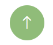

# AHMAD NAUFAL - 220907501030

Alat-alat yang saya gunakan untuk membuat website **Jagung Marning**:

  
  
  
  

 

# 1. HTML Codex untuk free template: [LINK](https://htmlcodex.com/template/)
# 2. Project IDX untuk mengedit template: [LINK](https://idx.dev/)
# 3. Xendit untuk add fitur payment gateaway: [LINK](https://www.xendit.co/id/)
# 4. Vercel untuk view real-time project website: [LINK](https://vercel.com/)

 

Tombol-tombol yang dimodifikasi di dalam website **Jagung Marning**:

  
  
  
  
  

 

# 1. Tombol Buy Now mengarahkan pengunjung: [LINK](#payment-gateaway)
# 2. Tombol Whatsapp mengarahkan pengunjung: [LINK](#whatsapp)
# 3. Tombol Shop Now mengarahkan pengunjung: [LINK](#products)
# 4. Tombol Contact Us mengarahkan pengunjung: [LINK](#whatsapp)
# 5. Tombol Panah Atas mengarahkan pengunjung: [LINK](#home)

 

# Home
# About
# Products
# Pages (Deals)
# Pages (Benefits)
# Pages (Testimonial)
# Pages (How To Enjoy)
# Contact
# Whatsapp
# Payment Gateaway